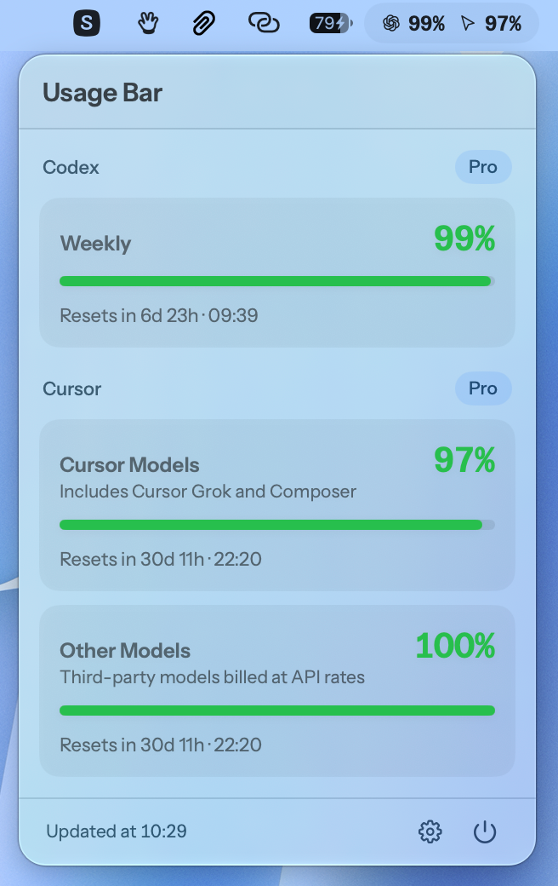

# UsageBar

Small macOS menu bar app (SwiftUI) that shows your **Codex** (ChatGPT plan),
**Claude Code** (Anthropic plan), **Cursor**, **OpenCode** and **Command Code**
usage limits: **percentage remaining** and time until reset.

<p align="center">
  
</p>

In the menu bar: `‹ChatGPT logo› 99% ‹Claude logo› 99% ‹Cursor logo› 99%` — the
Codex primary window, Claude Code's **Current session** bar, then Cursor's
**Cursor Models** pool (Grok and Composer). OpenCode's
**Current session** and Command Code's **Current session** windows can be turned
on in Settings. Settings let you pick which plans appear. The popover breaks
down every window on each side.

The whole label is **composed off-screen into a single template image**
(`MenuBarLabelImage`), and that is deliberate: `MenuBarExtra` renders only one
image and one text in its label, drops an image interpolated into a string, and
freezes the view hierarchy on first render — a segment added later by an `if`
would never appear. A single `Image` whose value alone changes works around all
three constraints. Do not go back to sibling views: two tests lock this in.

## Install

macOS 14 or newer, Apple Silicon and Intel. The GitHub zip is a **universal
binary**. The app installs into **Applications** as `/Applications/UsageBar.app`
(Finder shows **Usage Bar**). It runs in the menu bar only — no Dock icon.

### Option 1 — GitHub release (no Xcode)

1. Open the [latest release](https://github.com/DailyXplorer/Usage-Bar/releases/latest).
2. Download **`UsageBar.app.zip`**.
3. Unzip it.
4. Drag **Usage Bar** into **Applications**.
5. Open it from Applications.

If macOS refuses the first launch (ad-hoc signature), in Finder:
**right-click → Open**.

### Option 2 — checksum-verified installer script

```sh
curl -fsSLo UsageBar-install.sh https://raw.githubusercontent.com/DailyXplorer/Usage-Bar/main/scripts/install.sh
less UsageBar-install.sh
sh UsageBar-install.sh
rm UsageBar-install.sh
```

Inspect the downloaded script before running it. It verifies the release
tag once, downloads both assets from that exact tagged release, then checks the
SHA-256 file, bundle identifier, executable name, and ad-hoc code signature. It
stages the replacement in Applications with rollback before launching it and
stops a running Usage Bar first, so installation cannot leave two menu bar
instances.

### After install

- Open the popover from the menu bar icon.
- **Settings…** → **Launch at login** to start Usage Bar when you log in.
- **Settings…** → **Updates** to check GitHub or turn on automatic installs.
  When a newer release exists, an **Update** button also appears in the popover.
  Automatic checks are on by default; automatic installation requires opt-in.

You need a Codex CLI login (`codex login`) for ChatGPT limits, a Claude Code
login for Anthropic limits, a signed-in Cursor app for Cursor limits, an
`opencode-go` API key (`/connect` → OpenCode Go) for OpenCode limits, and a
Command Code login (`cmd login`) for Command Code limits. Missing accounts
are hidden, not errors.

### From source

Needs [Xcode Command Line Tools](https://developer.apple.com/download/all/?q=command%20line%20tools):

```sh
git clone https://github.com/DailyXplorer/Usage-Bar.git
cd Usage-Bar
chmod +x scripts/build-app.sh
scripts/build-app.sh
```

That compiles a release build and installs `/Applications/UsageBar.app`.

```sh
scripts/build-app.sh --no-install          # only .build/UsageBar.app
scripts/build-app.sh --no-install --zip    # also zip + .sha256 release assets
swift test                                 # unit tests
swift build && ./.build/debug/UsageBar     # debug binary, not the .app
```

Agents and maintainers: naming for branches, commits, and PRs is in
[CONVENTIONS.md](CONVENTIONS.md). Workflow, tests, and cutting a GitHub
release are in [AGENTS.md](AGENTS.md).

## How it works

### Codex

- Reads `~/.codex/auth.json` (the same file the Codex CLI uses) to get the
  ChatGPT `access_token` and `account_id`.
- Queries the official endpoint `https://chatgpt.com/backend-api/wham/usage`
  (the same one `codex /status` uses).
- Shows the primary window ("weekly", "5h", … depending on the duration the
  backend returns, same heuristic as the CLI) and the secondary window when
  present. When ChatGPT returns a Spark extra limit, the popover adds a
  **Spark** bar after those windows. Spark stays out of the menu bar, and the
  bar is hidden when the response has no matching Spark entry.

### Claude Code

- Reads the OAuth token from the macOS keychain through `/usr/bin/security`,
  exactly the way Claude Code writes it — that is what avoids a keychain
  authorization prompt on every launch. Falls back to
  `~/.claude/.credentials.json`. No token is ever copied or rewritten.
- Queries `https://api.anthropic.com/api/oauth/usage`, the endpoint Claude Code
  uses for its `/usage` command.
- Mirrors Claude Code's three built-in bars: **Current session**,
  **All models** and **‹model›** (the pinned per-model limit, e.g. Fable),
  each with its reset time. The menu bar shows **Current session**.
- If there is no Claude Code session, the section is simply hidden.

### Cursor

- Reads the session from Cursor's local store
  (`~/Library/Application Support/Cursor/User/globalStorage/state.vscdb`):
  `cursorAuth/accessToken` and `cursorAuth/stripeMembershipType`. No token is
  ever copied or rewritten.
- Queries `https://api2.cursor.sh/aiserver.v1.DashboardService/GetCurrentPeriodUsage`,
  the same dashboard usage endpoint.
- Mirrors Cursor's two plan pools: **Cursor Models** (Grok and Composer) and
  **Other Models** (third-party models billed at API rates), each with the
  billing-cycle reset. The menu bar shows the Cursor Models pool.
- If there is no Cursor session, the section is simply hidden.

### OpenCode

- Reads the `opencode-go` API key from OpenCode's `auth.json`. OpenCode stores
  that file under `$XDG_DATA_HOME/opencode` when set, otherwise
  `~/.local/share/opencode/auth.json`, then
  `~/Library/Application Support/opencode/auth.json`. No key is ever copied or
  rewritten.
- Queries `https://opencode.ai/zen/go/v1/usage`, the official Go quota endpoint,
  with the same Bearer key the TUI already uses.
- Mirrors the three Go windows: **Current session** ($12), **Weekly** ($30) and
  **Monthly** ($60), each with its reset time. The menu bar shows the current
  session window.
- If there is no `opencode-go` key, the section is simply hidden.

### Command Code

- Reads the API key the Command Code CLI writes to `~/.commandcode/auth.json`
  on `cmd login` (`apiKey`). `COMMAND_CODE_API_KEY` (or `COMMANDCODE_API_KEY`)
  overrides that file when set. No key is ever copied or rewritten.
- Queries the same public `/alpha` endpoints the CLI `/usage` view uses on
  `api.commandcode.ai`: `whoami` → `billing/subscriptions` → `billing/credits`
  → `usage/summary`.
- Mirrors the three subscription windows: **Current session** (5-hour cap),
  **Weekly** and **Monthly**, each with its reset time. The menu bar shows the
  current session window. Pay-as-you-go Provider accounts have no rolling
  windows, so the section stays hidden — the same treatment as OpenCode Zen.
- Plan badge: **Go**, **Goat**, **Pro**, **Max 10x**, **Max 20x**, **Team Pro**.
- If there is no Command Code key, the section is simply hidden.

All accounts are queried in parallel: a slow backend does not block the others,
and an error on one side does not wipe out the other sides' bars.

### Going easy on the endpoints

Claude's, Cursor's, OpenCode's and Command Code's usage endpoints return **429** if you hit
them too often. Three safeguards:

- the last state is **persisted** (`UserDefaults`) and redisplayed before any
  request, so restarting the app costs no network call and never shows "–" when
  the value is already known;
- a request is only issued when the data is more than 5 minutes old (so opening
  the popover does not systematically trigger a call; the "Retry" button does
  force one);
- on 429, **progressive backoff** (5 → 15 → 30 → 60 min), during which the last
  known values stay on screen.

`Updated at` timestamps the **data**, not the last attempt: a failed refresh
never passes stale state off as fresh. Persisted percentages are frozen at
capture time, but countdowns are recomputed from the reset time when read back.

- Shows the **% remaining** (e.g. 66% remaining = 34% used).
- Refreshes automatically every 5 minutes and when the popover opens.

## Design

- English interface.
- **Instrument Sans** typeface (variable, bundled in the app), including for the
  menu bar label. Careful: since the file is variable, only one face is
  registered (`InstrumentSans-Regular`). Weights go through the `wght` axis
  (`AppTheme.nsFont`); asking for "InstrumentSans-SemiBold" by name fails and
  **silently** falls back to the system font.
- Provider logomarks (Codex command-prompt mark, Claude spark, Cursor cube,
  OpenCode **O**, Command Code command symbol) are bundled as SVG and rendered
  as templates so they follow the menu bar theme. They are optically padded to
  read at the same size in the 12 px menu bar label and 16 px Settings row.
  **Hugeicons** `dashboard-speed-02` is the application icon.

## Requirements

- macOS 14+ (Sonoma or newer), Apple Silicon and Intel
- Signed in to the Codex CLI with a ChatGPT account: `codex login`
- For the Claude side: signed in to Claude Code (`claude`, then `/login`)
- For the Cursor side: signed in to the Cursor app
- For the OpenCode side: an `opencode-go` key (`/connect` → OpenCode Go)
- For the Command Code side: signed in to the Command Code CLI (`cmd login`)
- To **build from source**: Xcode Command Line Tools (`xcode-select --install`)

## Notes

- The app runs as an accessory agent: no Dock icon, menu bar only.
- Before installation, the archive must match the SHA-256 published beside it,
  both asset URLs must belong to the same tagged Usage Bar release, and
  code-signing verification checks the extracted app’s integrity. The
  signature is ad hoc, not a Developer ID identity: it does not authenticate a
  publisher. GitHub over HTTPS and the installer script you inspect remain the
  trusted distribution channel.
- No data leaves your machine beyond the usage requests to chatgpt.com,
  api.anthropic.com, api2.cursor.sh, opencode.ai and api.commandcode.ai,
  identical to the ones the CLIs, Cursor, OpenCode and Command Code themselves
  make, and the optional GitHub Releases check for updates.
- **Keychain**: the `Claude Code-credentials` entry is created by Claude Code
  through `/usr/bin/security`, so its ACL only trusts that binary. The app goes
  through the same path: no authorization prompt, including after a rebuild
  (the app is ad-hoc signed, so its signature changes every time).
- The Claude token is refreshed by Claude Code itself. If it has expired and
  Claude Code has not run in a while, the section shows "Claude token expired"
  until the next time Claude Code opens.
- The Cursor token is read from Cursor's local session store. If it has expired,
  the section shows "Cursor token expired" until the next time Cursor opens.
- The `opencode-go` key is read from OpenCode's local `auth.json`. If it is
  missing or rejected, the section stays hidden or shows that the key is
  invalid until the next `/connect`.
- The Command Code key is read from `~/.commandcode/auth.json`. If it is
  missing or rejected, the section stays hidden or shows that the key is
  invalid until the next `cmd login`.

## License

The code in this project is licensed under the **MIT** license — see
[LICENSE](LICENSE).

Bundled third-party assets keep their own:

- **Instrument Sans** (`Sources/UsageBar/Resources/Fonts/InstrumentSans.ttf`) —
  © 2022 The Instrument Sans Project Authors, under the
  [SIL Open Font License 1.1](https://openfontlicense.org). The license ships
  alongside the font
  ([`Fonts/OFL.txt`](Sources/UsageBar/Resources/Fonts/OFL.txt)), as the OFL
  requires: if you redistribute the app or the repo, keep that file next to the
  `.ttf`.
- **Hugeicons** (`Support/AppIcon.svg`) — `dashboard-speed-02` from the free
  set, MIT licensed, no attribution required.

The Codex/OpenAI, Claude/Anthropic, Cursor, OpenCode and Command Code logos
remain the property of their respective owners; they are used here to identify
the services being queried, not to imply any affiliation. This project is
affiliated with neither OpenAI, Anthropic, Cursor, OpenCode nor Command Code.
