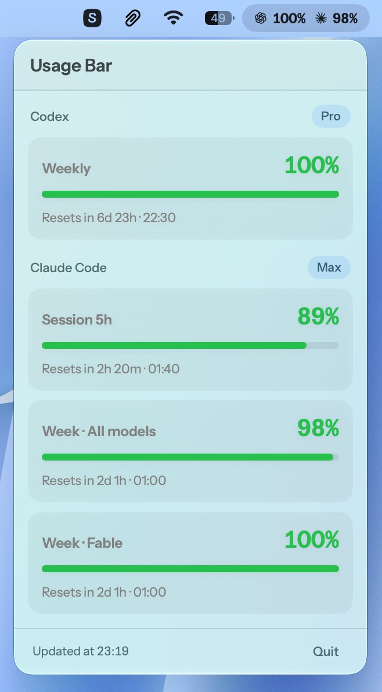

# UsageBar

Small macOS menu bar app (SwiftUI) that shows your **Codex** (ChatGPT plan) and
**Claude Code** (Anthropic plan) usage limits: **percentage
remaining** and time until reset.

<p align="center">
  
</p>

In the menu bar: `‹ChatGPT logo› 99% ‹Claude logo› 99%` — the Codex primary
window, then Claude Code's **All models** bar (the weekly all-models limit). The
popover breaks down every window on both sides.

The whole label is **composed off-screen into a single template image**
(`MenuBarLabelImage`), and that is deliberate: `MenuBarExtra` renders only one
image and one text in its label, drops an image interpolated into a string, and
freezes the view hierarchy on first render — a segment added later by an `if`
would never appear. A single `Image` whose value alone changes works around all
three constraints. Do not go back to sibling views: two tests lock this in.

## How it works

### Codex

- Reads `~/.codex/auth.json` (the same file the Codex CLI uses) to get the
  ChatGPT `access_token` and `account_id`.
- Queries the official endpoint `https://chatgpt.com/backend-api/wham/usage`
  (the same one `codex /status` uses).
- Shows the primary window ("weekly", "5h", … depending on the duration the
  backend returns, same heuristic as the CLI) and the secondary window when
  present.

### Claude Code

- Reads the OAuth token from the macOS keychain through `/usr/bin/security`,
  exactly the way Claude Code writes it — that is what avoids a keychain
  authorization prompt on every launch. Falls back to
  `~/.claude/.credentials.json`. No token is ever copied or rewritten.
- Queries `https://api.anthropic.com/api/oauth/usage`, the endpoint Claude Code
  uses for its `/usage` command.
- Mirrors Claude Code's three built-in bars: **Session 5h**,
  **Week · All models** and **Week · ‹model›** (the pinned per-model limit,
  e.g. Opus), each with its reset time.
- If there is no Claude Code session, the section is simply hidden.

Both accounts are queried in parallel: a slow backend does not block the other,
and an error on one side does not wipe out the other side's bars.

### Going easy on the endpoints

Claude's usage endpoint returns **429** if you hit it too often. Three
safeguards:

- the last state is **persisted** (`UserDefaults`) and redisplayed before any
  request, so restarting the app costs no network call and never shows "–" when
  the value is already known;
- a request is only issued when the data is more than 5 minutes old (so opening
  the popover does not systematically trigger a call; the "Retry" button does
  force one);
- on 429, **progressive backoff** (5 → 15 → 30 → 60 min), during which the last
  known values stay on screen.

`Updated at` timestamps the **data**, not the last attempt: a failed refresh
never passes stale state off as fresh. Persisted percentages are frozen at
capture time, but countdowns are recomputed from the reset time when read back.

- Shows the **% remaining** (e.g. 66% remaining = 34% used).
- Refreshes automatically every 5 minutes and when the popover opens.

## Design

- English interface.
- **Instrument Sans** typeface (variable, bundled in the app), including for the
  menu bar label. Careful: since the file is variable, only one face is
  registered (`InstrumentSans-Regular`). Weights go through the `wght` axis
  (`AppTheme.nsFont`); asking for "InstrumentSans-SemiBold" by name fails and
  **silently** falls back to the system font.
- **Hugeicons** `chat-gpt` and `claude` logos (Logos category, stroke · rounded),
  bundled as SVG and rendered as templates so they follow the menu bar theme.

## Build & run

```sh
chmod +x scripts/build-app.sh
scripts/build-app.sh
open .build/UsageBar.app
```

For the debug build:

```sh
swift build
./.build/debug/UsageBar
```

## Requirements

- macOS 14+ (Sonoma or newer)
- Signed in to the Codex CLI with a ChatGPT account: `codex login`
- For the Claude side: signed in to Claude Code (`claude`, then `/login`)
- Xcode Command Line Tools: `xcode-select --install`

## Notes

- The app runs as an accessory agent: no Dock icon, menu bar only.
- No data leaves your machine beyond the usage requests to chatgpt.com and
  api.anthropic.com, identical to the ones both CLIs make.
- **Keychain**: the `Claude Code-credentials` entry is created by Claude Code
  through `/usr/bin/security`, so its ACL only trusts that binary. The app goes
  through the same path: no authorization prompt, including after a rebuild
  (the app is ad-hoc signed, so its signature changes every time).
- The Claude token is refreshed by Claude Code itself. If it has expired and
  Claude Code has not run in a while, the section shows "Claude token expired"
  until the next time Claude Code opens.

## License

The code in this project is licensed under the **MIT** license — see
[LICENSE](LICENSE).

Bundled third-party assets keep their own:

- **Instrument Sans** (`Sources/UsageBar/Resources/Fonts/InstrumentSans.ttf`) —
  © 2022 The Instrument Sans Project Authors, under the
  [SIL Open Font License 1.1](https://openfontlicense.org). The license ships
  alongside the font
  ([`Fonts/OFL.txt`](Sources/UsageBar/Resources/Fonts/OFL.txt)), as the OFL
  requires: if you redistribute the app or the repo, keep that file next to the
  `.ttf`.
- **Hugeicons** (`chat-gpt.svg`, `claude.svg`) — icons from the free set, MIT
  licensed, no attribution required.

The ChatGPT/OpenAI and Claude/Anthropic logos remain the property of their
respective owners; they are used here to identify the services being queried,
not to imply any affiliation. This project is affiliated with neither OpenAI
nor Anthropic.
